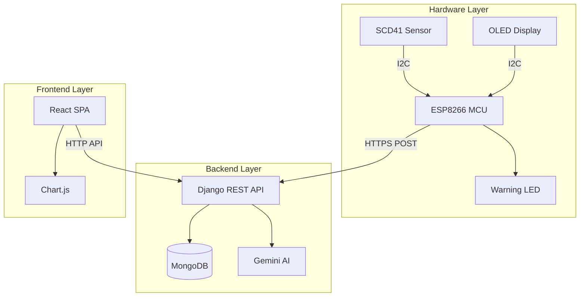
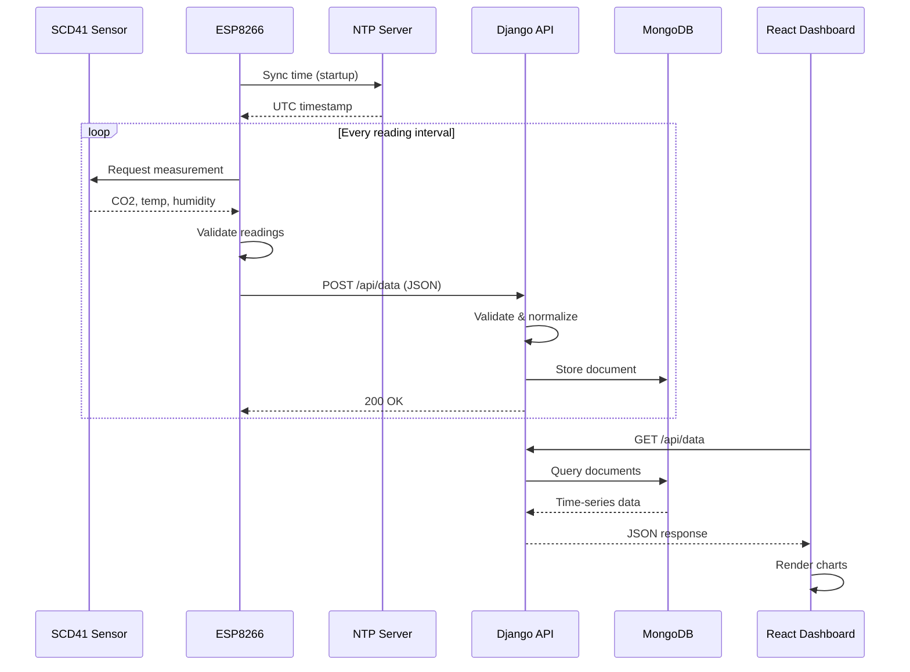

# Technicalities

Technical documentation for the Cognitiv environmental monitoring system.

## System Architecture

Cognitiv follows a three-tier architecture:



| Layer | Technology | Purpose |
|-------|------------|---------|
| Hardware | ESP8266 + SCD41 | Collects environmental data |
| Backend | Django + MongoDB | Stores data, serves API |
| Frontend | React + Chart.js | Visualizes data for users |

## Data Flow

### End-to-End Journey



### Timing

| Event | Interval |
|-------|----------|
| Sensor reading | Configurable (default: 10 seconds) |
| Dashboard refresh | 30 seconds |
| SCD41 warm-up | ~60 seconds after power-on |

## Hardware Layer

### ESP8266 Microcontroller

The system uses ESP8266-based boards (ESP12-E or ESP12-S modules). The LaskaKit AirBoard 8266 is the reference platform.

**I2C Pin Configuration:**

| Function | GPIO | Board Label |
|----------|------|-------------|
| SDA | GPIO 0 | D3 |
| SCL | GPIO 2 | D4 |

**WiFi:**
- 802.11 b/g/n
- Auto-reconnection on disconnect
- Station mode (connects to existing network)

### SCD41 Sensor

The Sensirion SCD41 provides all three measurements via I2C at address `0x62`.

| Measurement | Range | Accuracy |
|-------------|-------|----------|
| CO2 | 400–5000 ppm | ±40 ppm |
| Temperature | -10°C to 50°C | ±0.5°C |
| Humidity | 0–100% RH | ±3% RH |

**Validation bounds used in firmware:**
- CO2: 400–5000 ppm
- Temperature: -10°C to 50°C
- Humidity: 0–100%

Readings outside these ranges are rejected.

### OLED Display

Optional 128x64 SSD1306 display at I2C address `0x3C`.

Display modes:
- **Normal**: Shows CO2, temperature, WiFi/server status
- **Warning**: Activates when CO2 exceeds 2000 ppm — shows alert message with inverted display

### LED Warning System

A red LED provides visual warning when CO2 levels are elevated.

| CO2 Level | LED Behavior |
|-----------|--------------|
| < 2000 ppm | Off |
| >= 2000 ppm | Blinking (0.5s interval) |

The LED uses hardware timer interrupts (Ticker library) to maintain consistent blinking independent of main loop operations.

### Voltage Monitoring

The system reads battery/board voltage via ADC:
- ADC input range: 0–1V
- Voltage divider ratio: 2.0 (configurable)
- Measured range: 0–2V (extendable with different divider)

## Backend Layer

### Django REST API

The backend is built with Django and exposes a REST API.

**Key Files:**
- `server/api/views.py` — API endpoint handlers
- `server/api/urls.py` — URL routing
- `server/cognitiv/settings.py` — Django configuration

**Core Endpoints:**

| Endpoint | Method | Purpose |
|----------|--------|---------|
| `/api/data` | POST | Receive sensor data |
| `/api/data` | GET | Retrieve recent readings |
| `/api/stats` | GET | Statistical summary |
| `/api/history/series` | GET | Aggregated time-series |
| `/api/history/export` | GET | CSV download |
| `/api/ai/chat` | POST | AI assistant queries |

### Data Validation

Incoming sensor data is validated before storage:

1. Required fields: `device_id`, `timestamp`
2. Range checks for measurements
3. Type validation (numeric values)
4. Timestamp normalization to UTC

### AI Service

The AI assistant (MolekulAI) uses Google Gemini 2.5 Flash:
- Receives user questions via `/api/ai/chat`
- Context includes recent sensor readings
- Responds in Czech language
- Provides air quality recommendations

## Frontend Layer

### React Application

Built with React 18 and Vite.

**Component Structure:**
```
src/
├── components/
│   ├── dashboard/        # Main dashboard views
│   ├── admin/            # Device management
│   ├── ai/               # AI chat interface
│   ├── ui/               # Reusable UI components
│   └── layout/           # App shell, navigation
├── pages/                # Route pages
├── services/api.js       # API client
└── context/              # React context (auth)
```

### Charts

Data visualization uses Chart.js with react-chartjs-2:
- Line charts for time-series (CO2, temperature, humidity)
- Annotation plugin for threshold lines
- Auto-sampling for large datasets (>100 points)

### Air Quality Classification

| Level | CO2 Range | Color |
|-------|-----------|-------|
| Good | < 1000 ppm | Green |
| Moderate | 1000–1500 ppm | Yellow |
| High | 1500–2000 ppm | Orange |
| Critical | > 2000 ppm | Red |

## Communication Protocol

### JSON Payload Format

**Device to Server:**

```json
{
  "timestamp": 1699012345,
  "device_id": "ESP8266A2",
  "mac_address": "AA:BB:CC:DD:EE:FF",
  "temperature": 22.50,
  "humidity": 45.20,
  "co2": 650,
  "voltage": 3.85
}
```

**Server Response:**

```json
{
  "status": "success",
  "message": "Data byla přijata a uložena.",
  "timestamp": "2024-11-03 10:30:00"
}
```

### HTTPS Handling

The ESP8266 uses BearSSL for HTTPS connections:
- `WiFiClientSecure` with `setInsecure()` for development
- Production should use certificate pinning

### NTP Time Synchronization

Time is synchronized at startup via `pool.ntp.org`:
- Configurable GMT offset
- Daylight saving time offset
- All timestamps stored as Unix time or UTC

## Database Schema

### MongoDB Document Structure

```json
{
  "_id": "ObjectId(...)",
  "timestamp": "ISODate(2024-11-03T10:30:00Z)",
  "timestamp_str": "2024-11-03 10:30:00",
  "device_id": "ESP8266A2",
  "temperature": 22.5,
  "humidity": 45.2,
  "co2": 650,
  "voltage": 3.85,
  "raw_payload": { ... }
}
```

### Indexing

Primary index: `device_id` + `timestamp` (compound)

This supports efficient queries for:
- Recent data by device
- Time-range queries
- Aggregation pipelines

### Data Aggregation

The `/api/history/series` endpoint supports bucketing:

| Bucket | Description |
|--------|-------------|
| `raw` | Individual readings |
| `10min` | 10-minute averages |
| `hour` | Hourly averages |
| `day` | Daily averages |

## Configuration Reference

### Firmware Options (`config.h`)

| Define | Type | Description |
|--------|------|-------------|
| `WIFI_SSID` | string | WiFi network name |
| `WIFI_PASSWORD` | string | WiFi password |
| `SERVER_URL` | string | Backend API endpoint |
| `DEVICE_ID` | string | Unique device identifier |
| `READING_INTERVAL_MS` | int | Reading interval (ms) |
| `ENABLE_LOCAL_DEBUG` | 0/1 | Send to local server too |
| `LOCAL_SERVER_URL` | string | Local debug server |
| `GMT_OFFSET_SEC` | int | Timezone offset (seconds) |
| `RED_LED_PIN` | int | GPIO for warning LED |
| `VOLTAGE_DIVIDER_RATIO` | float | ADC voltage scaling |

### Server Environment Variables

| Variable | Default | Description |
|----------|---------|-------------|
| `MONGO_URI` | — | MongoDB connection string |
| `MONGO_DB_NAME` | cognitiv | Database name |
| `MONGO_COLLECTION` | sensor_data | Collection name |
| `LOCAL_TIMEZONE` | Europe/Prague | Display timezone |
| `DJANGO_SECRET_KEY` | — | Django secret |
| `DEBUG` | false | Debug mode |
| `GEMINI_API_KEY` | — | AI service key |
| `GEMINI_MODEL` | gemini-2.5-flash | AI model |

## Development Setup

### Local Development Server

1. Start MongoDB locally or use Atlas
2. Run Django backend:
   ```bash
   cd server
   python manage.py runserver 0.0.0.0:8000
   ```
3. Run React frontend:
   ```bash
   cd frontend
   npm run dev
   ```

### Testing Firmware Locally

Set `ENABLE_LOCAL_DEBUG` to 1 in `config.h` and update `LOCAL_SERVER_URL` with your computer's IP address (not `localhost` — the ESP8266 needs the actual IP).

### Serial Debugging

Connect via serial at 115200 baud to see:
- I2C scan results
- Sensor readings
- WiFi connection status
- HTTP response codes

## Deployment

The system is configured for Render.com deployment via `render.yaml`:

1. Frontend builds to `frontend/dist/`
2. Django collects static files
3. Gunicorn serves the application
4. MongoDB Atlas provides the database

Build process:
```bash
cd frontend && npm install && npm run build
cd ../server && pip install -r requirements.txt
python manage.py collectstatic --noinput
gunicorn cognitiv.wsgi:application
```


