# 1. System Overview

**Cognitiv** is an IoT-based Indoor Air Quality (IAQ) monitoring system tailored for educational institutions. It addresses the need for healthy learning environments by monitoring CO2, temperature, and humidity in real-time.

## 🎯 Project Goals

1.  **Health & Safety:** Prevent excessive CO2 levels which cause drowsiness and poor concentration.
2.  **Energy Efficiency:** Optimize ventilation scheduling based on actual data rather than arbitrary time intervals.
3.  **Educational Insight:** Correlate environmental conditions with specific classes, subjects, and room occupancy (via "Annotated Data").
4.  **Historical Analytics:** Provide tools for advanced data exploration and export via the "DataLab".

## 🏗️ System Architecture

The system follows a classic IoT **Edge-Hub-Client** topology:

```mermaid
graph LR
    subgraph "Classroom (Edge)"
        S[SCD41 Sensor] -->|I2C| ESP[ESP8266 Controller]
        ESP -->|MQTT/TLS| Broker[HiveMQ Broker]
        ESP -->|Visual| OLED[OLED Display]
        ESP -->|Visual| LED[Status LED]
    end

    subgraph "Cloud (Hub)"
        Broker -->|Subscribe| Django[Django Backend]
        Django -->|Store| Mongo[MongoDB Atlas]
        Bakalari[Bakaláři API] -->|Timetables| Django
        DL[DataLab Engine] --- Django
    end

    subgraph "User (Client)"
        Browser[React Dashboard] -->|HTTPS/JSON| Django
    end
```

### 1. Hardware Nodes (The "Edge")
Compact, WiFi-enabled devices placed in classrooms.
-   **Core:** ESP8266 microcontroller.
-   **Sensing:** Sensirion SCD41 (NDIR CO2 sensor).
-   **Feedback:** Immediate visual feedback via OLED display and a "Traffic Light" warning LED.

### 2. Backend Server (The "Hub")
A robust Python/Django application hosted on Render.com.
-   **Ingestion:** Listens to MQTT streams from all devices.
-   **Processing:** Validates data, enforces MAC address whitelists, and stores readings.
-   **Annotation:** Periodically fetches school timetables to tag sensor data with context (e.g., "Math Class", "Teacher: Mr. Smith").
-   **API:** Serves data to the frontend via REST endpoints.

### 3. Frontend Dashboard (The "Client")
A modern, responsive web application built with React.
-   **Real-time:** Shows live gauge readings.
-   **Historical:** Interactive charts for analyzing trends over days or months.
-   **Admin:** Tools for device management, room assignment, and system configuration.

## 🔄 Data Flow

1.  **Measurement:** The SCD41 sensor measures air quality every ~30 seconds (configurable).
2.  **Transmission:** The ESP8266 packages this into a JSON payload and publishes it to a secure MQTT topic.
3.  **Ingestion:** The Django backend (running an MQTT subscriber thread) receives the message.
4.  **Storage:** The raw reading is saved to a MongoDB Time-Series collection.
5.  **Visualization:** Users open the React dashboard; the browser requests the latest data via the API.
6.  **Analysis:** Background jobs aggregate this data into hourly summaries, linking it with the school schedule.
